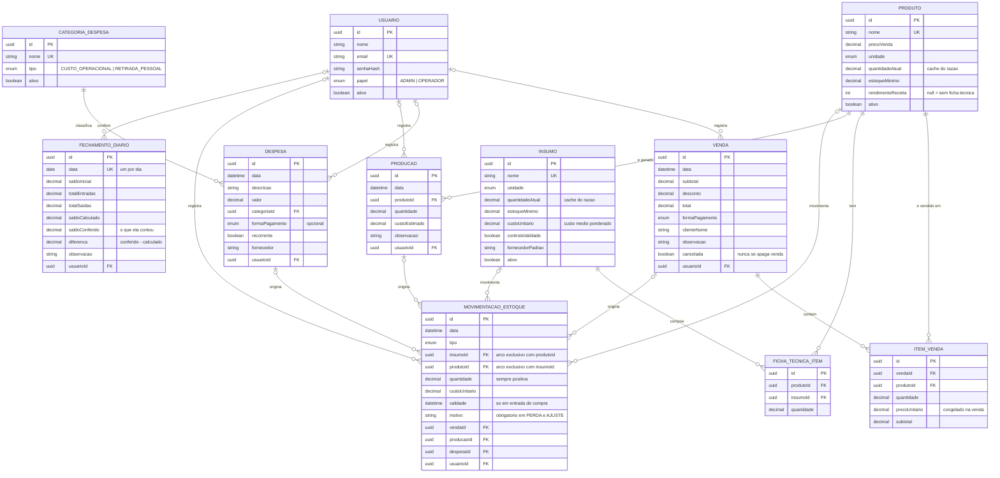

# Modelo de dados — MER e DER

Sistema de gestão da **Delícia Doces**. O modelo abaixo descreve o banco que está em produção, não uma versão idealizada: as cardinalidades e as opcionalidades foram conferidas contra `backend/prisma/schema.prisma` e contra o comportamento dos serviços.

- **Banco:** PostgreSQL 16 (Supabase, região `sa-east-1`)
- **ORM:** Prisma 7
- **Origem das decisões:** respostas da cliente (Dalila) no formulário de levantamento, 14/09

---

## 1. Modelo Conceitual (MER)

### 1.1 Entidades

| #   | Entidade                 | O que representa                                  |
| --- | ------------------------ | ------------------------------------------------- |
| E1  | **USUARIO**              | Quem opera o sistema                              |
| E2  | **INSUMO**               | Ingrediente ou embalagem comprado de fornecedor   |
| E3  | **PRODUTO**              | Doce pronto para venda                            |
| E4  | **FICHA_TECNICA_ITEM**   | Quanto de cada insumo um produto consome por lote |
| E5  | **PRODUCAO**             | Lote produzido: consome insumo e gera produto     |
| E6  | **VENDA**                | Entrada de dinheiro, sempre à vista               |
| E7  | **ITEM_VENDA**           | Cada doce vendido dentro de uma venda             |
| E8  | **CATEGORIA_DESPESA**    | Classificação da saída de dinheiro                |
| E9  | **DESPESA**              | Saída de dinheiro                                 |
| E10 | **MOVIMENTACAO_ESTOQUE** | Razão de tudo que entra e sai do estoque          |
| E11 | **FECHAMENTO_DIARIO**    | Conferência diária da gaveta                      |

### 1.2 Relacionamentos e cardinalidades

Notação `(mínimo, máximo)`, lida a partir da entidade da esquerda.

| #   | Relacionamento                             | Cardinalidade     | Observação                    |
| --- | ------------------------------------------ | ----------------- | ----------------------------- |
| R1  | USUARIO **registra** VENDA                 | (0,N) : (0,1)     | O usuário é opcional na venda |
| R2  | USUARIO **registra** DESPESA               | (0,N) : (0,1)     |                               |
| R3  | USUARIO **registra** PRODUCAO              | (0,N) : (0,1)     |                               |
| R4  | USUARIO **registra** MOVIMENTACAO_ESTOQUE  | (0,N) : (0,1)     |                               |
| R5  | USUARIO **confere** FECHAMENTO_DIARIO      | (0,N) : (0,1)     |                               |
| R6  | VENDA **contém** ITEM_VENDA                | **(0,N)** : (1,1) | Zero é válido — ver §1.3      |
| R7  | PRODUTO **é vendido em** ITEM_VENDA        | (0,N) : (1,1)     |                               |
| R8  | PRODUTO **tem** FICHA_TECNICA_ITEM         | (0,N) : (1,1)     | Ficha técnica é opcional      |
| R9  | INSUMO **compõe** FICHA_TECNICA_ITEM       | (0,N) : (1,1)     |                               |
| R10 | PRODUTO **é gerado por** PRODUCAO          | (0,N) : (1,1)     |                               |
| R11 | CATEGORIA_DESPESA **classifica** DESPESA   | (0,N) : (1,1)     |                               |
| R12 | INSUMO **movimenta** MOVIMENTACAO_ESTOQUE  | (0,N) : (0,1)     | Arco exclusivo — ver §1.4     |
| R13 | PRODUTO **movimenta** MOVIMENTACAO_ESTOQUE | (0,N) : (0,1)     | Arco exclusivo — ver §1.4     |
| R14 | VENDA **origina** MOVIMENTACAO_ESTOQUE     | (0,N) : (0,1)     | Rastreabilidade               |
| R15 | PRODUCAO **origina** MOVIMENTACAO_ESTOQUE  | (0,N) : (0,1)     | Rastreabilidade               |
| R16 | DESPESA **origina** MOVIMENTACAO_ESTOQUE   | (0,N) : (0,1)     | Rastreabilidade               |

**FICHA_TECNICA_ITEM** e **ITEM_VENDA** são entidades associativas: resolvem um relacionamento N:N (produto↔insumo e venda↔produto) e carregam atributos próprios.

### 1.3 Por que VENDA aceita zero itens

A cliente pediu um caminho de um toque para o balcão: digitar o valor e pronto, sem escolher doce. Essa entrada fica gravada como **venda sem itens** — a ausência de item é o próprio sinal, estrutural, sem depender de texto numa observação que pode ser apagada.

A venda avulsa entra no caixa, no lucro e no fechamento; só não movimenta estoque, porque o sistema não sabe o que saiu. Chutar um produto corromperia o saldo em silêncio.

Consequência para o modelo: a cardinalidade de R6 é **(0,N)** e não (1,N), como seria o padrão de um cabeçalho de nota.

### 1.4 Arco exclusivo em MOVIMENTACAO_ESTOQUE

Uma movimentação se refere a **exatamente um** entre `INSUMO` e `PRODUTO`, nunca aos dois e nunca a nenhum. Como o SQL não expressa isso com chave estrangeira, a restrição é garantida na aplicação (`estoqueService`) e coberta por teste automatizado.

O mesmo vale, de forma mais frouxa, para as três FKs de origem (`vendaId`, `producaoId`, `despesaId`): no máximo uma é preenchida, indicando de onde a movimentação nasceu.

---

## 2. Diagrama Entidade-Relacionamento (DER)

O bloco abaixo renderiza direto no GitHub. Para usar fora dele (slide, PDF, impressão), o mesmo diagrama está em [`diagramas/der.png`](diagramas/der.png) e [`diagramas/der.svg`](diagramas/der.svg) — o SVG não perde qualidade ao ampliar.

---

## 3. Modelo Lógico

### 3.1 Tabelas

| Tabela                  | PK   | Chaves estrangeiras                                                        | Restrições de unicidade   |
| ----------------------- | ---- | -------------------------------------------------------------------------- | ------------------------- |
| `usuarios`              | `id` | —                                                                          | `email`                   |
| `insumos`               | `id` | —                                                                          | `nome`                    |
| `produtos`              | `id` | —                                                                          | `nome`                    |
| `ficha_tecnica_itens`   | `id` | `produtoId`, `insumoId`                                                    | (`produtoId`, `insumoId`) |
| `producoes`             | `id` | `produtoId`, `usuarioId`                                                   | —                         |
| `vendas`                | `id` | `usuarioId`                                                                | —                         |
| `itens_venda`           | `id` | `vendaId`, `produtoId`                                                     | —                         |
| `categorias_despesa`    | `id` | —                                                                          | `nome`                    |
| `despesas`              | `id` | `categoriaId`, `usuarioId`                                                 | —                         |
| `movimentacoes_estoque` | `id` | `insumoId`, `produtoId`, `vendaId`, `producaoId`, `despesaId`, `usuarioId` | —                         |
| `fechamentos_diarios`   | `id` | `usuarioId`                                                                | `data`                    |

### 3.2 Comportamento das chaves estrangeiras

| Relação                                                       | Ação         | Por quê                                              |
| ------------------------------------------------------------- | ------------ | ---------------------------------------------------- |
| `itens_venda` → `vendas`                                      | **CASCADE**  | O item não existe fora da venda                      |
| `ficha_tecnica_itens` → `produtos`                            | **CASCADE**  | A linha da receita não existe fora do produto        |
| `movimentacoes_estoque` → `vendas` / `producoes` / `despesas` | **CASCADE**  | A movimentação nasceu do lançamento                  |
| `itens_venda` → `produtos`                                    | **RESTRICT** | Apagar produto vendido apagaria o histórico da venda |
| `movimentacoes_estoque` → `insumos` / `produtos`              | **RESTRICT** | O razão precisa continuar íntegro                    |
| `despesas` → `categorias_despesa`                             | **RESTRICT** | Despesa sem categoria quebraria o cálculo de lucro   |

> **Atenção, e está assim de propósito:** o `CASCADE` apaga a movimentação **sem devolver a quantidade ao saldo**. Por isso nenhum controller chama `delete` direto — toda exclusão passa pelo `estoqueService`, que estorna antes. Ver §4.1.

### 3.3 Índices

Além das PKs e chaves únicas: `data` em `producoes`, `vendas`, `despesas` e `movimentacoes_estoque` (todo filtro do sistema é por período); `cancelada` em `vendas`; `ativo` em `insumos` e `produtos`; `tipo`, `insumoId` e `produtoId` em `movimentacoes_estoque`.

### 3.4 Domínios enumerados

| Enum               | Valores                                                                                  |
| ------------------ | ---------------------------------------------------------------------------------------- |
| `PapelUsuario`     | `ADMIN`, `OPERADOR`                                                                      |
| `UnidadeMedida`    | `G`, `KG`, `ML`, `L`, `UNIDADE`, `PACOTE`, `LATA`, `CAIXA`                               |
| `FormaPagamento`   | `DINHEIRO`, `PIX`, `CARTAO_DEBITO`, `CARTAO_CREDITO`                                     |
| `TipoCategoria`    | `CUSTO_OPERACIONAL`, `RETIRADA_PESSOAL`                                                  |
| `TipoMovimentacao` | `ENTRADA_COMPRA`, `ENTRADA_PRODUCAO`, `SAIDA_PRODUCAO`, `SAIDA_VENDA`, `PERDA`, `AJUSTE` |

---

## 4. Decisões de modelagem

### 4.1 `quantidadeAtual` é cache, não fonte da verdade

A fonte da verdade do estoque é a tabela `movimentacoes_estoque` — o razão. Os campos `quantidadeAtual` em `insumos` e `produtos` são **cache**, mantido para não somar o razão inteiro a cada leitura de tela.

Cache exige um único escritor: o `estoqueService` é o **único** lugar autorizado a alterar esses campos, e sempre dentro de `$transaction`, para que movimentação e saldo mudem juntos ou nada mude. Se essa regra quebrar, o estoque mente e ninguém percebe na hora — por isso ela é a mais coberta por teste no projeto.

### 4.2 Validade fica na entrada, não no insumo

Cada compra tem a sua validade, então o campo mora em `movimentacoes_estoque`, não em `insumos`. O mesmo creme de leite pode ter três lotes com três datas.

**Limite conhecido:** o sistema não sabe quanto **resta** de cada lote, porque as saídas não apontam para qual entrada baixaram. A tela de validade mostra a quantidade que **entrou** e diz isso explicitamente. Rastrear saldo por lote exigiria amarrar cada saída a uma entrada — mudança que altera como a venda dá baixa.

### 4.3 Venda se cancela, não se apaga

`vendas.cancelada` é booleano. Cancelar estorna o estoque e mantém a linha: o histórico financeiro não pode ter buraco, e a cliente edita e corrige o tempo todo.

### 4.4 Preço congelado no item

`itens_venda.precoUnitario` guarda o preço **no momento da venda**. Se o preço do produto mudar amanhã, a venda de hoje continua valendo o que valeu. O valor vem sempre do cadastro do produto, nunca do que o cliente da API enviar.

### 4.5 Retirada pessoal não é custo

A cliente mistura dinheiro pessoal e do negócio. `TipoCategoria.RETIRADA_PESSOAL` separa a saída que **reduz o caixa mas não é custo do negócio** — sem isso, o lucro dela apareceria pior do que é. No fechamento diário, porém, a retirada conta como saída: da gaveta o dinheiro saiu de verdade.

### 4.6 O que NÃO foi modelado, e por quê

| Ausência                 | Motivo                                                                                                                                 |
| ------------------------ | -------------------------------------------------------------------------------------------------------------------------------------- |
| Contas a receber         | A cliente não vende fiado: recebe tudo na entrega                                                                                      |
| Parcelamento / sinal     | Mesma razão                                                                                                                            |
| Cliente como entidade    | Ela não costuma anotar quem comprou; ficou como texto livre em `vendas.clienteNome`                                                    |
| Fornecedor como entidade | Texto livre em `insumos.fornecedorPadrao` e `despesas.fornecedor`; virar entidade só se houver necessidade de histórico por fornecedor |
| Saldo por lote           | Ver §4.2                                                                                                                               |
